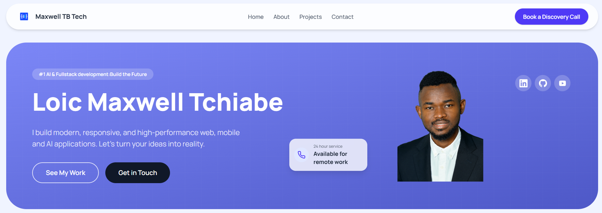

[](https://github.com/maxwell-tchiabe/site-web/blob/main/README.md)
[](https://github.com/maxwell-tchiabe/site-web/blob/main/README.zh.md)
[](https://github.com/maxwell-tchiabe/site-web/blob/main/README.fr.md)
[](https://github.com/maxwell-tchiabe/site-web/blob/main/README.es.md)

<div align="center">

</div>

# Maxwell TB Tech - Personal Portfolio Website

This is the repository for my personal portfolio website, built with React, TypeScript, and Tailwind CSS. It showcases my projects, skills, and provides a way for visitors to contact me.

## Features

- **Modern Frontend**: Built with React and Vite for a fast, modern user experience.
- **Responsive Design**: Fully responsive layout that works on all devices, from mobile phones to desktops.
- **Interactive UI**: Smooth animations and transitions using Framer Motion.
- **Component-Based Architecture**: Organized into reusable components for different sections like Hero, About, Projects, and Contact.
- **Contact Form**: Integrated with EmailJS to handle form submissions directly from the client-side.
- **Typed Codebase**: Utilizes TypeScript for robust, maintainable, and error-free code.

## Tech Stack

- **Frontend**: React, TypeScript, Vite
- **Styling**: Tailwind CSS
- **Animations**: Framer Motion
- **Email Service**: EmailJS

## Setup and Installation

### Prerequisites

- Node.js 18+
- npm / yarn / pnpm

### Local Development

1.  **Clone the repository:**
    ```bash
    git clone https://github.com/maxwell-tchiabe/site-web.git
    cd site-web
    ```

2.  **Install dependencies:**
    ```bash
    npm install
    ```

3.  **Configure environment variables:**
    Create a `.env` file in the root of the project and add your EmailJS credentials.
    ```
    VITE_EMAILJS_SERVICE_ID=your_service_id
    VITE_EMAILJS_TEMPLATE_ID=your_template_id
    VITE_EMAILJS_USER_ID=your_public_key
    ```

4.  **Run the development server:**
    ```bash
    npm run dev
    ```
    The application will be available at `http://localhost:3000` (or another port if 3000 is in use).

## Available Scripts

- `npm run dev`: Starts the development server.
- `npm run build`: Builds the application for production.
- `npm run preview`: Serves the production build locally for preview.

## Contributing

This is a personal project, but feel free to fork the repository and use it as a template for your own portfolio.

1.  Fork the repository
2.  Create a feature branch (`git checkout -b feature/amazing-feature`)
3.  Commit your changes (`git commit -m 'Add amazing feature'`)
4.  Push to the branch (`git push origin feature/amazing-feature`)
5.  Open a Pull Request

## Contributor

<table>
  <tr>
    <td align="center"></td>
    <td>
      <strong>Loic Maxwell Tchiabe | Passionierter Full Stack Developer | Spezialist für Angular, Java & Python </strong><br />
      <i>Cloud & AI Systems Enthusiast.</i><br /><br />
      <a href="https://www.linkedin.com/in/loic-maxwell-tchiabe-softwareentwickler-cloud-ai-java-python-angular/">LinkedIn</a><br />
      <a href="https://www.youtube.com/@MaxwellTBTech">Youtube</a><br />
    </td>
  </tr>
</table>

## License

This project is licensed under the MIT License.
